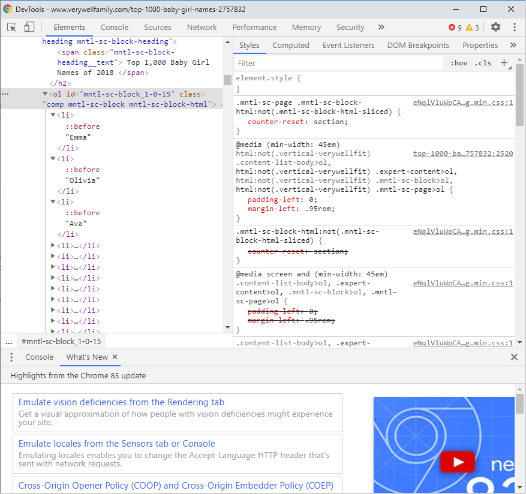
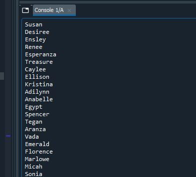
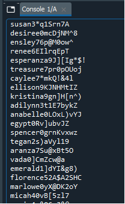
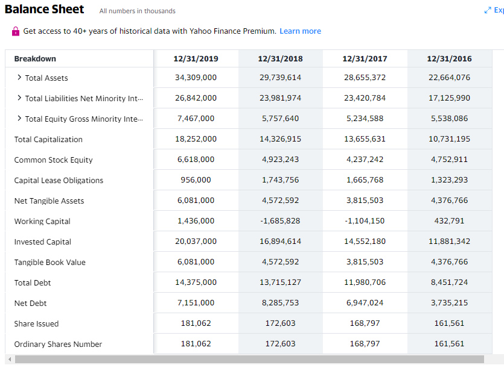
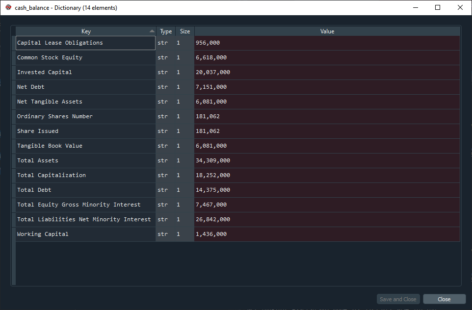

# Web scraping

Web scraping scripts to extract financial data. In a nutshell, this method can help you to get any information that it's available on any website using the [BeautifulSoup](https://www.crummy.com/software/BeautifulSoup/) library and python. The idea is to use this library to parse any DOM and get the data that we are interested in. Getting data from a list for example is a very simple job. Things get more interesting when we want to download more complex data like a table.

## 1) Installing BeautifulSoup

```cmd
pip install beautifulsoup4
or
python -m pip install beautifulsoup4
```

Output:

```bash
python -m pip install beautifulsoup4
Collecting beautifulsoup4
  Downloading beautifulsoup4-4.9.3-py3-none-any.whl (115 kB)
     |████████████████████████████████| 115 kB 3.3 MB/s
Collecting soupsieve>1.2; python_version >= "3.0"
  Downloading soupsieve-2.2-py3-none-any.whl (33 kB)
Installing collected packages: soupsieve, beautifulsoup4
Successfully installed beautifulsoup4-4.9.3 soupsieve-2.2
```

## 2) Simple Example (scraping names)

The following script example tries to generate random user names via web scraping. Firstly, we locate a website that contains a list of name that we can download and then we use this list to generate user names. To do this, we can browse for any of the top 1000 girl names and see any of the links available:

In our case, we found [this](https://family.disney.com/articles/1000-most-popular-girl-names/) url which seems pretty good for what we need. Upon inspecting the names, we can see that the DOM is pretty straightforward and each name is placed under 'li' tags and the whole group under an 'ol' tag:



To get the list of names on a usable format using python, we can use the BeautifulSoup library and locate the specific tags we want (ol and then li, and print the content of it). The code below shows how this can be done:

```python
# Let's create a random user name generator using web scraping.
# first we need to download a list of names to work on.
# the following url contains 1000 girl names and we will download them using web scraping.
url = 'https://family.disney.com/articles/1000-most-popular-girl-names/'
page = requests.get(url)
content = page.content
soup = BeautifulSoup(content, 'html.parser')

# Find the first 'ol' that contains the list of items
list = soup.find('ol')
# Each name in the list is stored under a 'li' item
list_names = list.find_all('li')
# Now print all the names that we have scraped from the web site
for name in list_names:
    print(name.get_text())
```



With a little tweak, we can easily generate usernames based on this data or whatever you want to do with it.

```python
# Generate the following sequence 
# abcdefghijklmnopqrstuvwxyzABCDEFGHIJKLMNOPQRSTUVWXYZ0123456789!()@$^&*[]
chars = string.ascii_letters + string.digits + '!()@$^&*[]'
random.seed = (os.urandom(1024))

for name in list_names:
    extra_digits = ''.join(random.choice(string.digits))
    extra_chars = ''.join(random.choice(chars) for i in range(8))
    username = name.get_text().lower() + extra_digits + extra_chars
    print(username)
```



## 3) Complex Example (scraping financial information)

One of the most interesting uses for this technology is the ability to download larges amounts of data that are table based. This example tries to download the balance sheet from one of the stocks in Yahoo Finance. Imagine that we want to download the balance sheet of TSLA (if you want to download the data, you need to become a premium subscriber and they have made it difficult to perform web scraping). To perform this operation, we need to look at the way the table is created (a bunch of div tags) and how each row is composed (classes, ids) so they are easily identifiable. 

Balance Sheet: https://finance.yahoo.com/quote/TSLA/balance-sheet?p=TSLA&_guc_consent_skip=1596652371



```python
import requests
from bs4 import BeautifulSoup

# Download Balance Sheet table from TSLA
url = 'https://finance.yahoo.com/quote/TSLA/balance-sheet?p=TSLA'
page = requests.get(url)
content = page.content
soup = BeautifulSoup(content, 'html.parser')

cash_balance = {}

# Search for the main DIV that encloses the balance sheet table
main_content = soup.find_all('div', class_='M(0) Whs(n) BdEnd Bdc($seperatorColor) D(itb)')
for div in main_content:
    # Look for each DIV that encloses every single row
    sub_div = div.find_all('div', class_='D(tbr) fi-row Bgc($hoverBgColor):h')
    for sub in sub_div:
        # Select the first column as the index of our dictionary and select the second column as the data to store (2019)
        cash_balance[sub.get_text(separator="|").split("|")[0]] = sub.get_text(separator="|").split("|")[1]
        #print(sub.get_text())
```

The final result of the execution of the code above lets us produce the desired output, scraping the data from the Yahoo Finance page for the TSLA ticker:



# Containeraizing the script

In order to make the script easily deployable, we'll create a Flask service that will host the retrieval of the cash balances and it will be all contained into a docker image. 

## Create the Flask service

```python
import requests
from bs4 import BeautifulSoup
from flask import Flask, jsonify
server = Flask(__name__)

@server.route("/")
def cash_balance_get():
     # Download Balance Sheet table from TSLA
    url = 'https://finance.yahoo.com/quote/TSLA/balance-sheet?p=TSLA'
    page = requests.get(url)
    content = page.content
    soup = BeautifulSoup(content, 'html.parser')
    
    cash_balance = {}
    
    # Search for the main DIV that encloses the balance sheet table
    main_content = soup.find_all('div', class_='M(0) Whs(n) BdEnd Bdc($seperatorColor) D(itb)')
    for div in main_content:
        # Look for each DIV that encloses every single row
        sub_div = div.find_all('div', class_='D(tbr) fi-row Bgc($hoverBgColor):h')
        for sub in sub_div:
            # Select the first column as the index of our dictionary and select the second column as the data to store (2019)
            cash_balance[sub.get_text(separator="|").split("|")[0]] = sub.get_text(separator="|").split("|")[1]
            #print(sub.get_text())
            
    return jsonify(cash_balance)

if __name__ == "__main__":
   server.run(host='0.0.0.0')
```

If we run this code and try to get to `http://localhost:500`, we'll get the following response:

```json
{"Capital Lease Obligations":"1,540,000","Common Stock Equity":"22,225,000","Invested Capital":"33,964,000","Net Debt":"-","Net Tangible Assets":"21,705,000","Ordinary Shares Number":"960,000","Share Issued":"960,000","Tangible Book Value":"21,705,000","Total Assets":"52,148,000","Total Capitalization":"31,832,000","Total Debt":"13,279,000","Total Equity Gross Minority Interest":"23,075,000","Total Liabilities Net Minority Interest":"29,073,000","Working Capital":"12,469,000"}
```

The output of the execution can be seen below:

```bash
runfile('C:/Users/thund/Source/Repos/web-scraping/web_scraping_yahoo_finance_balance_sheet_server.py', wdir='C:/Users/thund/Source/Repos/web-scraping')
 * Serving Flask app "web_scraping_yahoo_finance_balance_sheet_server" (lazy loading)
 * Environment: production
   WARNING: This is a development server. Do not use it in a production deployment.
   Use a production WSGI server instead.
 * Debug mode: off
 * Running on http://0.0.0.0:5000/ (Press CTRL+C to quit)
127.0.0.1 - - [03/Apr/2021 16:00:03] "GET / HTTP/1.1" 200 -
127.0.0.1 - - [03/Apr/2021 16:00:03] "GET /favicon.ico HTTP/1.1" 404 -
```

## Preparing the docker file

```docker
# set base image (host OS)
FROM python:3.7

# set the working directory in the container
WORKDIR /code

# copy the dependencies file to the working directory
COPY web_scraping_packages.txt .

# install dependencies
RUN pip install -r web_scraping_packages.txt

# copy the script to the working directory
COPY web_scraping_yahoo_finance_balance_sheet_server.py .

# command to run on container start
CMD [ "python", "./web_scraping_yahoo_finance_balance_sheet_server.py" ]
```

Include the packages to be installed as part of the docker image creation (`web_scraping_packages.txt`):

```bash
requests==2.22.0
beautifulsoup4==4.7.1 
Flask==1.1.1
```

Create the image:

```bash
C:\Users\thund\Source\Repos\web-scraping>docker build -t web_scraping:v1 .
[+] Building 547.8s (10/10) FINISHED
 => [internal] load build definition from Dockerfile                                                               0.0s
 => => transferring dockerfile: 526B                                                                               0.0s
 => [internal] load .dockerignore                                                                                  0.0s
 => => transferring context: 2B                                                                                    0.0s
 => [internal] load metadata for docker.io/library/python:3.7                                                     42.6s
 => [1/5] FROM docker.io/library/python:3.7@sha256:8b3d5242ba72ac32785362c4ade75b61ce941bd454f8e1c585270736c991  495.1s
 => => resolve docker.io/library/python:3.7@sha256:8b3d5242ba72ac32785362c4ade75b61ce941bd454f8e1c585270736c9916f  0.0s
 => => sha256:8b3d5242ba72ac32785362c4ade75b61ce941bd454f8e1c585270736c9916fe6 1.86kB / 1.86kB                     0.0s
 => => sha256:581b9e21ee31fd842281d787d150f92ff8850be52ab00ba7ad75f3167cb397a4 9.04kB / 9.04kB                     0.0s
 => => sha256:48c2faf66abec3dce9f54d6722ff592fce6dd4fb58a0d0b72282936c6598a3b3 10.00MB / 10.00MB                  50.9s
 => => sha256:b161a84f5d6d6a1588a3fbea618c464e0599094524a09b689cb3f455fbf33344 2.22kB / 2.22kB                     0.0s
 => => sha256:004f1eed87df3f75f5e2a1a649fa7edd7f713d1300532fd0909bb39cd48437d7 50.43MB / 50.43MB                 232.4s
 => => sha256:5d6f1e8117dbb1c6a57603cb4f321a861a08105a81bcc6b01b0ec2b78c8523a5 7.83MB / 7.83MB                    23.8s
 => => sha256:234b70d0479d7f16d7ee8d04e4ffdacc57d7d14313faf59d332f18b2e9418743 51.84MB / 51.84MB                 263.6s
 => => sha256:6fa07a00e2f029c4b2c7f177a2b696f1b3510040cde4f5bb06ddbca98e7fbf76 192.35MB / 192.35MB               479.7s
 => => sha256:04a31b4508b8e95fb3cb25486c4068185054895b12e0611e386a002ee9c0e07c 6.15MB / 6.15MB                   268.2s
 => => extracting sha256:004f1eed87df3f75f5e2a1a649fa7edd7f713d1300532fd0909bb39cd48437d7                          7.7s
 => => extracting sha256:5d6f1e8117dbb1c6a57603cb4f321a861a08105a81bcc6b01b0ec2b78c8523a5                          0.9s
 => => extracting sha256:48c2faf66abec3dce9f54d6722ff592fce6dd4fb58a0d0b72282936c6598a3b3                          0.9s
 => => sha256:9039bc4ee433b9b3917b5a7506b20c4335921059058fb626f21c10942f68bf1d 16.33MB / 16.33MB                 326.7s
 => => extracting sha256:234b70d0479d7f16d7ee8d04e4ffdacc57d7d14313faf59d332f18b2e9418743                          5.3s
 => => sha256:9d4af2d5ba9c3e8e735b90ee7041e6bb0d8a21d8e816a0ed781c4feca39d6da1 233B / 233B                       276.2s
 => => sha256:dc46d185ff1dbb7fd44a2d045b44e3c8edeec432507a2c7712ff6d31bf802aec 2.17MB / 2.17MB                   284.0s
 => => extracting sha256:6fa07a00e2f029c4b2c7f177a2b696f1b3510040cde4f5bb06ddbca98e7fbf76                         12.2s
 => => extracting sha256:04a31b4508b8e95fb3cb25486c4068185054895b12e0611e386a002ee9c0e07c                          0.5s
 => => extracting sha256:9039bc4ee433b9b3917b5a7506b20c4335921059058fb626f21c10942f68bf1d                          1.1s
 => => extracting sha256:9d4af2d5ba9c3e8e735b90ee7041e6bb0d8a21d8e816a0ed781c4feca39d6da1                          0.0s
 => => extracting sha256:dc46d185ff1dbb7fd44a2d045b44e3c8edeec432507a2c7712ff6d31bf802aec                          0.3s
 => [internal] load build context                                                                                  0.1s
 => => transferring context: 2.12kB                                                                                0.0s
 => [2/5] WORKDIR /code                                                                                            1.4s
 => [3/5] COPY web_scraping_packages.txt .                                                                         0.1s
 => [4/5] RUN pip install -r web_scraping_packages.txt                                                             7.9s
 => [5/5] COPY web_scraping_yahoo_finance_balance_sheet_server.py .                                                0.1s
 => exporting to image                                                                                             0.3s
 => => exporting layers                                                                                            0.3s
 => => writing image sha256:d36f971bc093676c0d91b95308e1a3097aff29de5b55c4cb912e7903cc60b49e                       0.0s
 => => naming to docker.io/library/web_scraping:v1                                                                 0.0s
```

Run the image:

```bash
C:\WINDOWS\system32>docker run -it --rm -p 5000:5000 web_scraping:v1
 * Serving Flask app "web_scraping_yahoo_finance_balance_sheet_server" (lazy loading)
 * Environment: production
   WARNING: This is a development server. Do not use it in a production deployment.
   Use a production WSGI server instead.
 * Debug mode: off
 * Running on http://0.0.0.0:5000/ (Press CTRL+C to quit)
172.17.0.1 - - [03/Apr/2021 17:14:13] "GET / HTTP/1.1" 200 -
```
